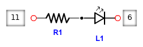
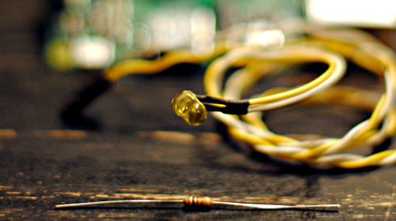
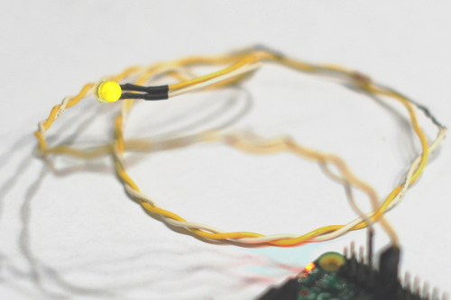
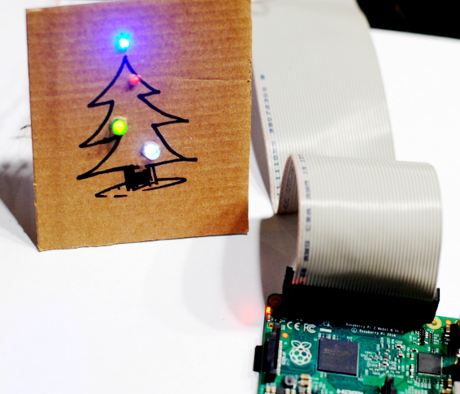

Deck the Halls with Raspberry Pi
--------------------------------

.. raw:: html

    

I'm continually on the lookout for ways to connect with my children, especially
my eldest with whom I do not share naturally compatible interests. And while I
expected to engage them easily over interesting technologies, reality has
proved less straightforward, more ambiguous. I'm sure there are many causes and
influences, but one obvious theme concerns the sheer scope and pace of
technological advancement since my own childhood. My first computer — a
Commodore VIC-20 — seems hopelessly primitive next to the bewildering
assortment of hypernetworked computing devices my children see their
grandparents carry in a pocket.

While I struggle to identify the essential difference in our experiences, I
suspect that part of what has changed is that my children aren't interested in
computers *as such* the way I was. They beg to get tablet time to watch videos
or play an online game, but everything they experience is professionally
produced and logically ordered, with all the rough edges and sharp corners
neatly rounded off into beautiful, pleasing curves.

My formative experiences were quite different. To them, using a VIC-20 would
seem like a pathetically empty experience by contrast with the devices they're
used to. No slick fade ins to carefully crafted notifications blending
seamlessly with expensive, highly tuned interfaces to precisely-defined
destinations. Even turning the VIC on felt like a primordial act, the massive,
honest-to-goodness SPST coursing with power that flowed past your finger and
off toward unknown and terrifying adventures. Yet even after that nothing much
happened, nothing but a blinking blue expectancy, a half imagined whisper of
potential. But of course that was the magic of it: you didn't turn on a VIC so
much for what it could already do; you turned it on because of what you could
*make* it do, for all of the wonderful creative possibilities its existence
suggested. While the intervening decades have brought transformative
advancements in the capabilities of our information technologies, the
exploratory capacity, this frontier-like horizon that was the VIC's foremost
asset, can become lost in the well-worn ruts of design.

This helps explain why, on a whim shortly before Christmas, I packed my boys
into the truck and headed over to Micro Center to pick up a Raspberry Pi 2. The
mere act of purchasing one jarred me a little by its contrast with my memories
of the agonized handwringing and haggling of my youth over the purchase of some
part or accessory, which cost much more and did much less than the tiny little
box the three of us carried out of the store. But for an old-timer like me
there's something compelling about these little devices that manages to
recapture some of the joy of possibility that hooked me on computing in the
first place. Perhaps it's the physical board itself, so unlike a phone or
tablet, with its rough circuit board edges crammed to bursting with connectors,
sharp solder points and interface pins sticking weirdly out of every surface.
Or maybe it's the surprising scale that delights, the wonder that something
so small can do so much. It could be all those I/O pins practically begging to
be hooked up to lights, sensors, and other gizmos. Whatever the reason, there
is something about this device that manages to break through the conventional
abstractions to reawaken wonder, the possibility of possibility.

Our first Pi project was a humble one: a software-controlled LED.

As with most tech projects, even something as seemingly simple as a light on a
switch requires daunting amounts of paraphernalia, patience, and time. For us,
though, that was part of the fun: trucking around town on some fool idea of
dad's, rummaging in obscure corners of the basement closet for resistors, LEDs,
and bits of wire, the improbability of seeing the Pi driving an HDTV, fidgeting
while the adults scratched their heads over some technical snag.

To get started on your own Pi adventure, you'll need a Raspberry Pi board [#]_,
a micro SD card `with the Raspbian OS installed <https://www.raspberrypi.org/downloads/raspbian/>`_ [#]_,
a micro USB power source (such as a phone charger), a screen with HDMI or
composite video inputs and appropriate cabling, and a USB keyboard and mouse.
(Whew!) Test booting the Pi up to make sure you have a working setup; there is
nothing quite like the frustration of getting stuck for an hour and then
discovering a bad cable.

For the LED mini project you'll need a few more parts: an LED, a `current
limiting resistor <https://learn.sparkfun.com/tutorials/light-emitting-diodes-leds/leds-without-math>`_,
some wire, and jumpers to attach to the Pi's GPIO pins. If you've got an old
desktop computer lying around, you can scrounge the LED, wire, and jumpers from
its indicator lights. And you should probably get yourself a breadboard and
jumper wires for it, but for this simple circuit I was content to solder the
components directly.

There are many excellent showcase and tutorial sites out there to spur project
ideas and help you get going. We headed over to `Gordon's Projects Single LED
tutorial <https://projects.drogon.net/raspberry-pi/gpio-examples/tux-crossing/gpio-examples-1-a-single-led/>`_,
which takes you through the steps of getting the LED connected, and he does a
nice job of breaking the narrative into digestible chunks and interspersing
concept explanations to help orient beginners. (I still find the multiplicity
of GPIO pin numbering and addressing schemes confusing, but I don't think
that's Gordon's fault). Following his instructions we quickly had the LED
wired up and connected to our Pi, which we then tested with the ``gpio``
utility, prepackaged with Raspbian Jessie, that can be used to communicate with
the Pi's GPIO bus. From the console we ran these commands:

.. raw:: html

     
    
     

The pattern of these commands is ``gpio <subcommand> <pin> <value>``, so the
first command translates roughly to “set GPIO user pin 0 to output mode.” GPIO
pins can be configured for input or output, depending on whether you are
reading from a sensor or driving a motor or LED. Once the pin was configured,
we used the second command to turn the LED on and the third to turn it off.

With that working, the obvious next step was to control the LED using Python.
There are several Python libraries for interacting with GPIO; we used `GPIO
Zero, as documented in this tutorial
<https://www.raspberrypi.org/learning/getting-started-with-gpio-zero/worksheet/>`_
by the Raspberry Pi Foundation. Here's the same sequence of commands as above,
but this time using Python:

.. raw:: html

     
    
     

Instead of interacting directly with the bus, GPIO Zero provides a number of
utility classes for dealing with commonly used devices; unsurprisingly the
``LED`` class is used to control an LED. The class encapsulates the fact that
the LED is an output device and configures the pin to output mode for us when
we instantiate the class.

Why ``17``? That's the pin number according to the GPIO numbering scheme, which
is equivalent to wiringPi user pin 0 (hence the ``0`` in the ``gpio`` commands
above); both refer to physical pin 11 on the board. Ahem.

Pin numbers aside, our next challenge was to make the LED blink, which we
accomplished with this simple Python script:

.. raw:: html

     
    
     

.. [#] I recommend the Raspberry Pi 2 Model B, but the older models should work
       as well. Avoid the Raspberry Pi Zero when you're starting out: the Zero
       is incredibly cool and tiny, but it is less user-friendly than the other
       models as it lacks some of their connectivity conveniences.

.. [#] There are `serveral other OS options <https://www.raspberrypi.org/downloads/>`_
       for the Pi, and you should obviously go play around with all of them.
       The examples in this post assume the presence of several supporting
       tools and libraries that are preloaded on Raspbian Jessie.
